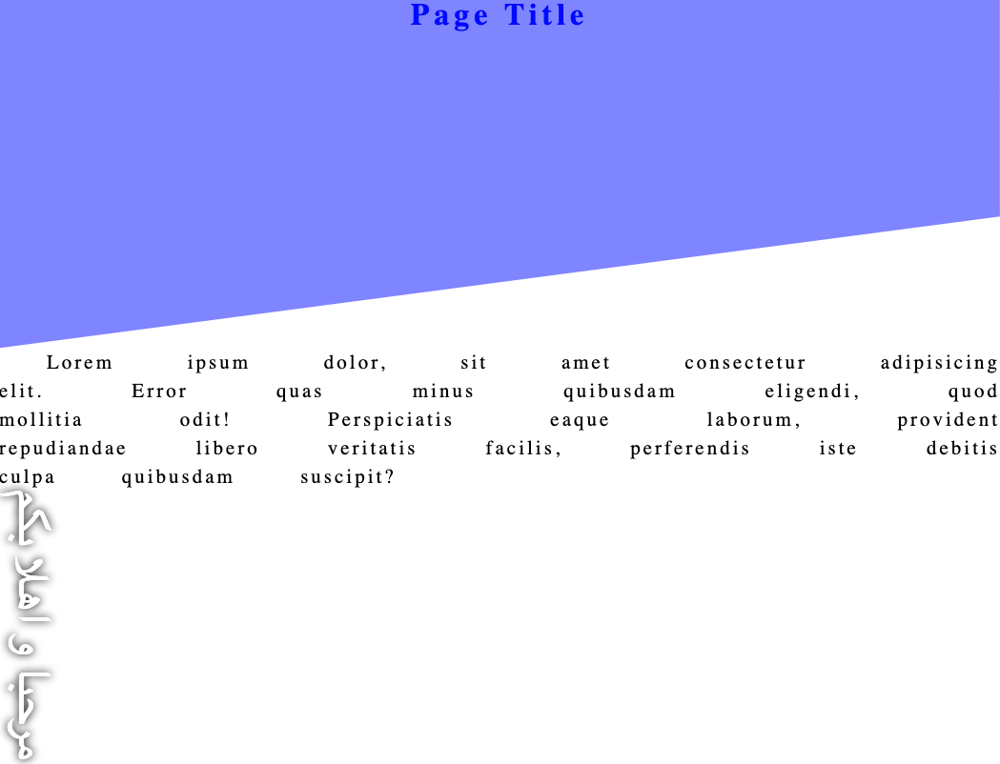
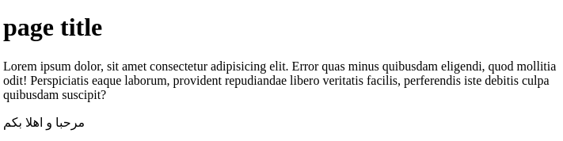

# Bonusaufgabe: pseudo, clip-path, writing-mode

**Instructions**:

Create the CSS.style, without changing the html. Using pseudo classes. 
It shall look like the reference.png picture

Goal:  

Before:  

My result: https://itsanytime.github.io/temp/pseudo+clip-path+writing-mode/index.html